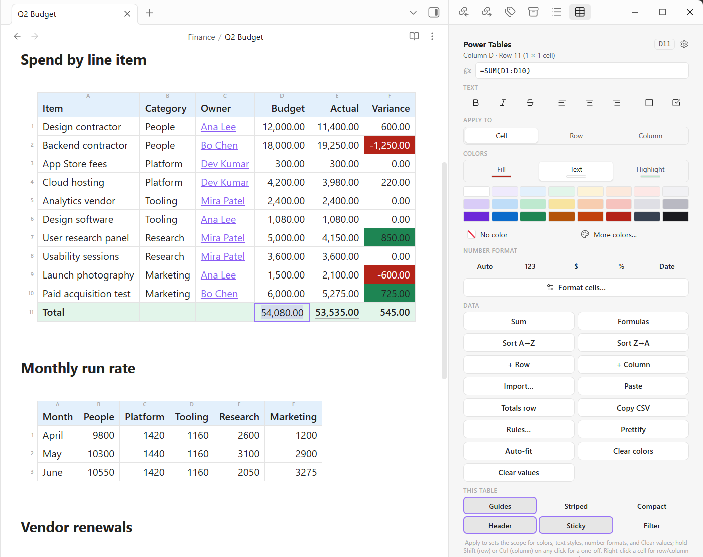

# Power Tables

Excel-grade power tools for Markdown tables in Obsidian: **cell fill and text colors** from a floating toolbar, **live calculations** (sum, average, min, max, count) that recalculate as you type, and **smart sorting** that understands numbers, currency, and dates, all while your tables stay **plain Markdown**.



[](https://buymeacoffee.com/powerplugins)

Fills mark the two overspends and the two largest savings, the figures carry
currency formatting, and the Total row is live: the formula bar shows the
selected cell is `=SUM(D2:D11)`, and 54,080.00 minus 53,535.00 is the 545.00 in
the variance column. Everything on the left is still plain Markdown in the file.

## Features at a glance

- Cell fill, text color, and text-highlight modes; conditional color rules, one-shot or kept live on a column
- Live totals and Excel-style formulas: 41 functions including `VLOOKUP`, `INDEX`/`MATCH`, `IFERROR`, `SUMIF`, and the text and date families, with `^ & %` operators, a formula bar, and AutoSum over a drag selection
- References that survive editing: insert, delete, move, sort, or duplicate rows and columns and every formula is rewritten to keep meaning what it meant
- Fill down and fill right over a selection, with `$B$2` anchoring to pin what shouldn't travel
- A formula bar that completes function names and takes references by clicking cells, and Excel's error values (`#VALUE!` `#NAME?` `#REF!` `#N/A` `#DIV/0!`) so a broken formula says what broke
- A selection bar whenever you drag-select cells: column alignment right there, plus Sum, Avg, Count and one-click AutoSum when the cells are numbers
- Sorting that understands numbers, currency, and dates; row and column moves; insert, delete, duplicate
- Number, currency, percent, date, and time formats, including sticky column/row formats
- Checkboxes in cells, drag-resizable and auto-fit column widths, cell borders, bold/italic/strike, alignment
- CSV/Excel import and export, table prettifier, Excel-style cell reference guides
- Everything stored as plain Markdown: notes stay portable and degrade gracefully without the plugin

New here? Run the command **Insert demo table** to see most of this working in ten seconds.

## How it stores colors

The plugin never converts your table to HTML. It wraps the *content* of a cell in one inline span, which Obsidian renders natively:

```markdown
| Bed Size | Price Per Piece |
| -------- | --------------- |
| Queen    | <span class="ptb" style="background:#0F0">$19.60</span> |
```

While editing in Live Preview the wrapper is invisible (and so are whole-value `**bold**` / `*italic*` / `~~strike~~` markers), so the focused cell shows just the value, still painted with its colors. Turn this off with the "Hide cell markup while editing" setting. Source mode always shows the raw markup.

The plugin then paints the whole `<td>` from that span, so the entire cell fills with color (not just the text) in both Reading view and Live Preview. If you ever uninstall the plugin, notes still open fine everywhere; the colors degrade to a simple text highlight, and "Clear" (or deleting the span) restores a plain cell.

## Install (manual)

1. Copy `manifest.json`, `main.js`, and `styles.css` into `<your vault>/.obsidian/plugins/powertables/`.
2. In Obsidian: **Settings → Community plugins** → turn off Restricted mode if prompted → reload plugins (or restart Obsidian / Ctrl+R) → enable **Power Tables**.

## Use

1. Open the **Power Tables sidebar**: click the **table icon** in the left ribbon (it also opens itself the first time you edit inside a table each session; you can turn that off in settings). Prefer a floating panel? Run the command *Toggle floating panel*; drag its header to park it anywhere.

The panel shows a live **cell reference** (like `B3`) for the targeted cell and groups its tools into sections: **Text** (bold, italic, strikethrough, column alignment, borders), **Apply to** (Cell / Row / Column: the scope that colors, text styles, number formats, and Clear values act on), **Colors**, **Number format**, and **Data** (live calcs, totals row, sorting, insert row/column, CSV import, clipboard paste, clearing). **Right-click any table cell** for row/column operations: insert above/below/left/right, duplicate row, clear contents, delete row/column.

The table bar's two split buttons stand in for a row of them, the way Excel consolidates the same tools: **AutoSum** sums the selection or the column on click, with Average, Count, Max, Min and a way through to row totals and the formula editor on its arrow; **Format** opens the number formats (General, Number, Currency, Accounting, Short and Long date, Time, Percentage), each previewed against the targeted cell's own value so you pick by what it will look like. Only formats this plugin can actually render are listed. Markdown stays the source of truth: the date entries rewrite anything that parses as a date (`3-14-12`, `2012-03-14`, `Mar 14, 2012` …) into the chosen style. For finer control there is also a floating, draggable **Format cells…** dialog: decimal places, thousands separator, negative styles including red and accounting parentheses, currency symbols (the four presets or any symbol you type; currency symbols like ₹ stay summable, letter codes format only), and date/time formats, all previewed on the targeted cell's own value and applied at the Apply-to scope. With Apply to set to Row or Column, tick **Keep formatting** to make the format sticky: it's stored as a `data-fmt` tag on the column's header cell (or the row's first cell) and automatically re-applied as cells change and new rows or columns arrive. The cell being typed in is left alone until the cursor moves on.

2. Target a cell:
   - **Editing view (Live Preview or Source):** just put the cursor in the cell.
   - **Reading view:** click the cell and it gets an accent outline.
   - **Drag-select several cells** (Live Preview): colors, bold/italic/strike, alignment, borders, number formats, and Clear values apply to **every selected cell** (modifier keys still override per click). A **selection bar** appears while the selection is live, carrying the three column-alignment buttons so you never have to cross the screen for them, and Sum, Avg, Count with a one-click `Σ Insert` when the cells hold numbers.
3. Pick what you're coloring with the **Cell fill / Text** toggle (the small bar under each shows its current color), then click a color:
   - The palette is Office-style: a **Theme colors** row with auto-generated tints and shades below each color, plus the classic **Standard colors** row.
   - Set **Apply to** to Row or Column to make every color, text style, number format, and Clear values click act on the whole row/column, or hold **Shift** (row) / **Ctrl** (column) for a one-off.
   - **No color** clears that property; **More colors…** opens a full color picker (click it again to close).
   - **Clear table** removes every color from the table under the cursor / last clicked cell.
4. **Borders** (the ▢ button in the Text row) work like Excel's menu at the Apply-to selection: bottom/top/left/right edge, **All borders**, **Outside** or **Thick outside** borders around the cell, row, or column, and **No border** to clear. Excel's stacked presets are there too: thick bottom, double bottom, and top-and-bottom in thin, thick or double. **Draw Borders** arms a pen: *Draw border* lays an edge on whichever side of a cell you drag nearest, *Draw border grid* boxes every cell you cross, *Erase border* strips them, and the whole drag commits as one edit rather than one per cell. *Line style* picks thin, thick, double, dashed or dotted; *Line color* picks from seven named colors (names rather than arbitrary hex, because the edges are painted by CSS off the stored attribute and a fixed set keeps the note portable). Esc, or the same menu entry again, puts the pen down. Edges are stored in the cell's wrapper (`data-b="tblr"`, uppercase = thick, `=` ahead of a letter for double, so `t=b` is a thin top over a double bottom) and painted by the plugin's CSS, so the table stays plain Markdown and degrades cleanly without the plugin.

### Checkboxes, highlights & column widths

- **Checkboxes**: the ☑ button in the Text row adds `[ ]` to the cell (follows Apply to, so a column of todos is one click). Cells starting with `[ ]` / `[x]` render as **real checkboxes**: tick them in Reading view (or unfocused Live Preview cells) and the markdown updates itself. The markdown stays a plain `[x] Buy milk`.
- **Text highlight**: the Colors section has a third mode, **Fill | Text | Highlight**. Highlight paints just the data inside the cell (rounded, like a text highlighter) instead of flooding the whole cell; it's stored as the same span with a `ptb-hl` marker class.
- **Column widths**: hover the right edge of any **header cell** and drag (the cursor changes). This works in Reading view and Live Preview. The width is saved as `data-w` on that column's header cell, so it survives sorting and column moves and degrades to nothing without the plugin. Right-click → *Reset column width* to clear it. **Phones ignore stored widths** so columns can shrink and text can wrap to fit the screen; tablets and desktops apply them.
- **Auto-fit column widths**: the panel's **Auto-fit** button (also in the right-click menu and the command palette) measures the rendered table and sizes every column to its widest entry, the smallest width that still shows all the data. **Double-click** a header cell's right edge to auto-fit just that column, like Excel. The results are stored as the same `data-w` tags a drag would write.

### Live calculations

The **Σ Calc** button turns the targeted cell into a **live calculation** over its column or row (Sum, Average, Min, Max, or Count):

1. Add a "Total" row if you don't have one (right-click the table → Insert row below), or skip the manual steps entirely: the panel's **Totals row** button (or the *Insert totals row* command) appends one with a label and a live sum under every numeric column.
2. Put the cursor in (or click) the cell where the result should go.
3. Click **Σ Calc** and pick a function. From then on the value **recalculates automatically** whenever the note changes (shortly after you stop typing, on file open, and on external edits/sync). Live cells show a subtle dotted underline. Picking a different function on a live cell switches it; picking the same one (or **Freeze value**) turns it back into plain text.

In the Markdown, a live cell is just a marked span holding the last value, so the table stays valid everywhere:

```markdown
| Total | <span class="ptb" data-calc="sum:col">$130.60</span> |
```

The math understands `$`/`€`/`£`/`¥` prefixes, thousands commas, and accounting-style `(5.00)` negatives; it ignores text cells, the header row, and the result cell itself, and matches the output style to the inputs (`$32.00 + $19.60 + $79.00 → $130.60`; Count is always a bare integer). Colors on the cell are preserved, and calcs can feed other calcs (row totals + a grand total settle automatically). If a live value ever looks stale, any edit to the note refreshes it. In the formula bar a live calc reads as the formula it is, such as `=SUM(B:B)` for a column sum or `=SUM(3:3)` for a row sum.

### Formulas

Cells can hold Excel-style formulas. Type `=SUM(B2:B4)` (or `=C2*1.08`, `=AVG(B2,B4)`, `=(A2+A3)*2`, `=SUM(B:B)` for a whole column) into a cell, use the **formula bar** at the top of the sidebar (Enter or clicking away commits to the cell you loaded it from; Esc cancels), or right-click and choose *Edit value / formula…*. The cell becomes a live formula: the computed value is stored in the markdown (so notes render everywhere), the formula rides along in the wrapper, and everything recalculates automatically when referenced cells change. References are Excel-literal: column letters and 1-based rows that count the header, so `C1` is column C's header cell and `C2` is its first data row, matching the numbers in the gutter and the numbers you would use in a spreadsheet. Header cells are addressable like any other, so a formula can live in one and be referenced from elsewhere. Every function takes ranges, whole columns (`B:B`), whole rows (`3:3`), or plain argument lists:

| | |
|---|---|
| Math and stats | `SUM` `AVG`/`AVERAGE` `MIN` `MAX` `MEDIAN` `PRODUCT` `SUMPRODUCT` `STDEV` `POWER` `SQRT` `INT` `MOD` `ABS` `ROUND` `ROUNDUP` `ROUNDDOWN` |
| Counting | `COUNT` `COUNTA` `COUNTBLANK` |
| Conditional | `IF` `IFERROR` `AND` `OR` `NOT` `SUMIF` `COUNTIF` `AVERAGEIF` |
| Text | `LEN` `LEFT` `RIGHT` `MID` `TRIM` `UPPER` `LOWER` `CONCAT` |
| Lookup | `VLOOKUP` `MATCH` `INDEX` |
| Dates | `YEAR` `MONTH` `DAY`, read off a date cell |

Operators are Excel's, with Excel's precedence: `+ - * / ( )`, `^` for powers (right associative, so `2^3^2` is 512), `&` to join text, a postfix `%`, and the comparisons `= <> > < >= <=`. Unary minus binds tighter than `^`, so `-2^2` is 4, same as Excel. Everything is evaluated by a built-in parser, never `eval`. `TODAY()` and `NOW()` are deliberately absent: computed values are stored in the note, so a clock-dependent formula would rewrite your notes on open every time the date rolled over. **Fill down and fill right** write a formula once and apply it to a range. Drag-select the cells and run *Fill down* (the panel's `Fill ↓`, the right-click menu, or the command, which takes a hotkey if you want Excel's Ctrl+D): the top of the selection copies into the rest, and each copy's references move with it, so `=C2-B2` becomes `=C3-B3` down the column. With a single cell targeted it fills from the row above, the way Ctrl+D does in Excel. *Fill right* is the same across columns. Anchor anything that shouldn't travel with `$`: `=B3*$B$2` filled down keeps reading the one rate cell while its other reference follows each row. `$B$2` pins both, `$B2` pins the column, `B$2` pins the row, exactly as in Excel, and anchors are ignored when the formula is simply evaluated. Note that a `$` only holds a copy still: inserting a row above an anchored cell still moves the reference, because the cell itself moved, which is also how Excel behaves.

**References follow structural edits, the way Excel's do.** Insert a row in the middle and `=SUM(D2:D3)` becomes `=SUM(D2:D4)`; the rows below keep pointing at their own cells. Delete a row and the range shrinks to match. Move or sort rows and every formula travels with its data instead of reading whatever landed in that slot. Duplicate a row and the copy computes from its own cells. Insert or delete a column and the letters shift. Delete something a formula actually named and you get `#REF!`, which says what to go fix, rather than a plausible wrong number.

**When a formula fails it says which kind of wrong it is**, using Excel's error values, because each one points somewhere different: `#VALUE!` at an argument (text where a number belongs), `#NAME?` at what you typed (an unknown function, or input that will not parse), `#REF!` at something that was deleted, `#N/A` at a lookup that found nothing, `#DIV/0!` and `#NUM!` at impossible arithmetic. Wrap anything in `IFERROR` to substitute a value instead. The one code Excel does not have is `#CIRC!`, for a cell that ends up referring to itself: Excel warns in a dialog and leaves the cell reading 0, which is not available from inside a note, and a silent 0 is the failure this plugin is least willing to ship.

The **formula bar completes function names** as you type: `=VL` offers `VLOOKUP`, arrow keys move through the list, Tab or Enter accepts and drops you inside the parentheses. And it does **point mode**, Excel's click-to-reference: with the caret somewhere a reference could go (just after `=`, an operator, `(`, or `,`) the bar's border picks up the accent color, and clicking a cell inserts its address instead of jumping to it. Click through the cells you want, type the operators between them, press Enter. Anywhere else in the formula a click still just targets that cell, so nothing changes about the way you normally move around. Formula values feed live calcs and other formulas; chains settle automatically. Formulas and live calcs keep their number format: formatting one (quick buttons or Format cells…) stores the format on the cell, and every recomputation renders through it. A formula's own format wins over its row's, which wins over its column's.

### Conditional color rules

**Rules…** (sidebar or command palette) colors cells in the targeted column by condition: pick an operator (greater than / less than / equals / contains / between / is empty / is not empty / matches pattern), a value where the condition needs one (`between` takes `10 ~ 20`; patterns are case-insensitive regular expressions), and fill/text colors. Classic use: negatives in red (`less than 0` gives red text). The **color scale (min→max)** condition is different: it tints every numeric cell between two fills by where its value sits in the column's range. Pick the low and high colors where the color rows normally are, and the gradient re-shades live as values change. **Apply once** paints the matches now and stores nothing; **Add rule** stores the rule on the column's header cell and re-applies it automatically as values change. A column can hold several rules: they are checked top to bottom and the first match colors the cell, so put the more specific condition first. Colors you set by hand on individual cells always win over rules. Reopen **Rules…** on any cell in the column to see its rules and edit or remove them (removing a rule leaves the colors it already painted). Rules live per column, so every column of every table can have its own set. The dialog floats, so drag it by its title if it covers your table.

### Sort & reorder

The **Sort** button sorts the table's body rows by the targeted column, ascending or descending:

- **Numbers and currency sort numerically** (`$1,644.00` > `$79.00`), dates like `1/15/2026` or `2026-01-15` sort chronologically, everything else sorts alphabetically; blank cells always land at the bottom.
- Rows move as whole lines, so **colors and live calcs travel with their rows**, and any row containing a live calc (your Total row) stays **pinned to the bottom**.
- The same menu has **Move row up/down** and **Move column left/right**; column moves carry the alignment row along.

### Import & export (Excel / CSV)

**Import…** (sidebar or command palette) opens a paste box for rows copied from Excel/Sheets (tab-separated) or CSV text. The delimiter is auto-detected and quoted fields are handled. **Append rows** adds the data to the targeted table; **Replace table** rebuilds it with the first line as the header. With no table targeted, a fresh table is inserted at the cursor. Going the other way, **Copy CSV** puts the whole table on the clipboard as clean CSV (markup and color wrappers stripped) ready for Excel.

Commands (assignable to hotkeys): *Open Power Tables sidebar*, *Toggle floating panel*, *Fill / Color text / Highlight with last color*, *Clear colors in current cell/table*, *Toggle live column/row sum*, *Sort table by current column (asc/desc)*, *Move row/column*, *Insert row above/below*, *Insert column left/right*, *Duplicate row*, *Delete row/column*, *Clear cell contents*, *Import CSV / Excel data…*, *Paste data from the clipboard (append rows)*, *Insert totals row*, *Format cells…*, *Fill down*, *Fill right*.

### On mobile

Everything renders and edits on phones and tablets; notes colored on desktop look identical on mobile. The panel opens with the *Open panel* command and lives in the right drawer (swipe in from the right edge). For one-tap actions without the drawer, add Power Tables commands to Obsidian's keyboard toolbar (Settings → Toolbar): *Fill with last color*, *Toggle live column sum*, *Insert row below*, and friends. A long-press on any table cell opens the same context menu as a desktop right-click.

## Settings

- **Auto-open sidebar**: reveal the Power Tables pane the first time you edit inside a table each session.
- **Cell reference guides**: Excel-style column letters above and row numbers beside every table, with the header as row 1 and the first data row as 2, exactly as Excel numbers them (on by default).
- **Hide cell markup while editing**: collapse the `<span>` wrapper and whole-value bold/italic/strike markers in Live Preview, keeping the cell rendered with its colors (on by default).
- **Striped rows** / **Compact tables**: global table appearance toggles.
- **Header fill**: paint every table's header row with one color, chosen via the swatch next to the toggle (on by default, soft blue). It's pure styling (no files change) and per-cell header colors you set explicitly still win over it. **Header fill in dark mode** keeps a separate color for dark themes.
- **Palette (dark mode)**: optional second swatch set used while the app is in dark mode (the panel re-reads it when the theme flips); leave empty to use one palette everywhere.
- **Sticky headers**: the header row stays pinned while a long table scrolls, in both Reading view and Live Preview (on by default).
- **Filter row**: a type-to-filter box under each column header in Reading view (off by default; flip it on globally here, or per table with the panel's Filter button). Matching is case-insensitive contains, multiple boxes combine, Esc clears a box. Filtering only hides rows on screen. The note never changes. Striped tinting follows the original row positions, so stripes can look uneven while a filter is active.
- The panel's **This table** buttons (Guides / Striped / Compact / Header / Sticky / Filter) override those appearance settings for just the targeted table. The override is stored in the note like everything else, so it travels with the file and survives sorts and column moves; toggling a table back to the global state removes it.
- **Palette**: comma-separated hex codes shown 8 per row (up to 32).
- **Open floating panel on startup**

## Limitations

- Tables nested inside callouts or list items: color them from the editing view (cursor targeting works there); Reading-view click targeting may not resolve those cells.
- Colors are absolute (like Word/Excel), so pick shades that work with your light/dark theme.

## What the catalog's scan reports

The community catalog scans a plugin for what it is *capable* of, which is not the same as what it does with it. Power Tables reports one thing.

| What the scan reports | What it is | Where |
| --- | --- | --- |
| **Clipboard access** | **Writing:** the CSV from **Copy table as CSV**, and a diagnostic report from the troubleshooting command. **Reading:** the **Paste rows** command, its table-menu entry, and its toolbar button, which take spreadsheet rows off the clipboard and append them to the table you targeted. Every one of the five is something you just clicked or ran. Nothing reads the clipboard on its own, on a timer, or in the background. | [`src/main.ts`](src/main.ts) `pasteFromClipboard`, `copyTableCsv` |

Power Tables makes no network requests of any kind, starts no processes, reads no files outside your vault, and never asks Obsidian for a list of your files. There is no `eval`, no `Function` constructor, no `innerHTML`, and no code fetched and run at runtime.

## Build from source

```
npm install
npm run build   # typecheck + bundle main.js
npm test        # unit tests for the table-rewrite logic
```

`node_modules/` is build tooling only (TypeScript, esbuild, Obsidian API types). It is never shipped; the installed plugin is just `manifest.json`, `main.js`, and `styles.css` (about 31 KB total). You can delete `node_modules/` at any time and recreate it with `npm install`.

## Publishing to the Obsidian community plugin directory

1. Push this folder to a public GitHub repo (the `.gitignore` already keeps `node_modules/` and `main.js` out). `manifest.json`, `versions.json`, `LICENSE`, and `README.md` must be at the repo root.
2. Run `npm run build`, then create a GitHub release whose **tag is exactly the version from manifest.json** (e.g. `1.13.1`, with no `v` prefix). Attach `manifest.json`, `main.js`, and `styles.css` to the release as individual files.
3. Sign in at [community.obsidian.md](https://community.obsidian.md), link your GitHub account, then choose **Plugins > New plugin** and give it the repository URL. The directory reviews the release automatically and lists what it wants changed; fix those and cut a new release to have it look again. (Submissions used to be a pull request against `obsidian-releases`. They are not any more.)
4. For later updates: bump `version` in `manifest.json` and `package.json`, add the entry to `versions.json`, rebuild, and cut a new release with the same three files. Installed users get the update automatically.

Users installing from the community directory only ever download the three release files, never the repo or its build tooling.

## Support

Power Tables is built and maintained by one person. If it earns a place in your
daily vault, you can [buy me a coffee](https://buymeacoffee.com/powerplugins).
Nothing in the plugin is held back either way.
