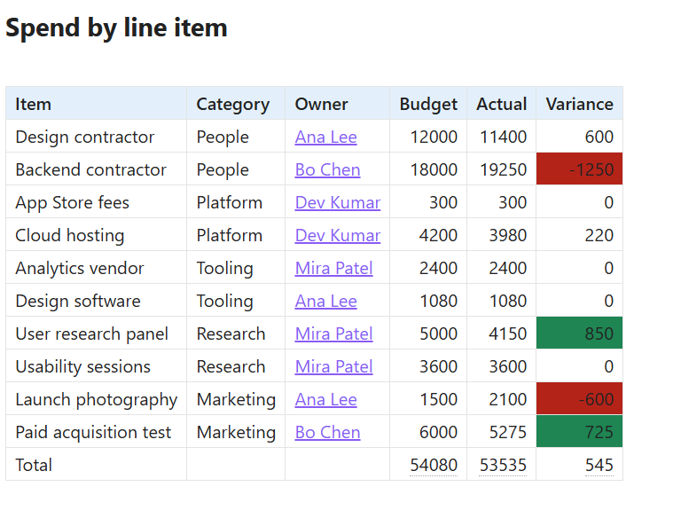

# Power Tables

Excel-grade power tools for Markdown tables in Obsidian: **cell fill and text colors** from a floating toolbar, **live calculations** (sum, average, min, max, count) that recalculate as you type, and **smart sorting** that understands numbers, currency, and dates, all while your tables stay **plain Markdown**.



Cell fills mark the two overspends and the two largest savings. The Total row is
live: 54080 minus 53535 is the 545 in the variance column, and every figure
recalculates as the table is edited. The file underneath is still Markdown.

## Features at a glance

- Cell fill, text color, and text-highlight modes; conditional color rules, one-shot or kept live on a column
- Live totals and Excel-style formulas: `=SUM(B:B)`, `=C1*1.08`, `IF`, `SUMIF`, `COUNTIF`, `ROUND`, `ABS`, with a formula bar and AutoSum over a drag selection
- A stats chip (Sum, Avg, Count) whenever you select numeric cells
- Sorting that understands numbers, currency, and dates; row and column moves; insert, delete, duplicate
- Number, currency, percent, date, and time formats, including sticky column/row formats
- Checkboxes in cells, drag-resizable and auto-fit column widths, cell borders, bold/italic/strike, alignment
- CSV/Excel import and export, table prettifier, Excel-style cell reference guides
- Everything stored as plain Markdown: notes stay portable and degrade gracefully without the plugin

New here? Run the command **Insert demo table** to see most of this working in ten seconds.

## How it stores colors

The plugin never converts your table to HTML. It wraps the *content* of a cell in one inline span, which Obsidian renders natively:

```markdown
| Bed Size | Price Per Piece |
| -------- | --------------- |
| Queen    | <span class="ptb" style="background:#0F0">$19.60</span> |
```

While editing in Live Preview the wrapper is invisible (and so are whole-value `**bold**` / `*italic*` / `~~strike~~` markers), so the focused cell shows just the value, still painted with its colors. Turn this off with the "Hide cell markup while editing" setting. Source mode always shows the raw markup.

The plugin then paints the whole `<td>` from that span, so the entire cell fills with color (not just the text) in both Reading view and Live Preview. If you ever uninstall the plugin, notes still open fine everywhere; the colors degrade to a simple text highlight, and "Clear" (or deleting the span) restores a plain cell.

## Install (manual)

1. Copy `manifest.json`, `main.js`, and `styles.css` into `<your vault>/.obsidian/plugins/powertables/`.
2. In Obsidian: **Settings → Community plugins** → turn off Restricted mode if prompted → reload plugins (or restart Obsidian / Ctrl+R) → enable **Power Tables**.

## Use

1. Open the **Power Tables sidebar**: click the **table icon** in the left ribbon (it also opens itself the first time you edit inside a table each session; you can turn that off in settings). Prefer a floating panel? Run the command *Toggle floating panel*; drag its header to park it anywhere.

The panel shows a live **cell reference** (like `B3`) for the targeted cell and groups its tools into sections: **Text** (bold, italic, strikethrough, column alignment, borders), **Apply to** (Cell / Row / Column: the scope that colors, text styles, number formats, and Clear values act on), **Colors**, **Number format**, and **Data** (live calcs, totals row, sorting, insert row/column, CSV import, clipboard paste, clearing). **Right-click any table cell** for row/column operations: insert above/below/left/right, duplicate row, clear contents, delete row/column.

The quick format buttons (`Auto` `123` `$` `%` `Date`) reformat cells in one shot; markdown stays the source of truth. `Date` rewrites anything that parses as a date (`3-14-12`, `2012-03-14`, `Mar 14, 2012` …) to `m/d/yyyy`. Other date styles live in Format cells…. For Excel-style control there is also a floating, draggable **Format cells…** dialog: decimal places, thousands separator, negative styles including red and accounting parentheses, currency symbols (the four presets or any symbol you type; currency symbols like ₹ stay summable, letter codes format only), and date/time formats, all previewed on the targeted cell's own value and applied at the Apply-to scope. With Apply to set to Row or Column, tick **Keep formatting** to make the format sticky: it's stored as a `data-fmt` tag on the column's header cell (or the row's first cell) and automatically re-applied as cells change and new rows or columns arrive. The cell being typed in is left alone until the cursor moves on.

2. Target a cell:
   - **Editing view (Live Preview or Source):** just put the cursor in the cell.
   - **Reading view:** click the cell and it gets an accent outline.
   - **Drag-select several cells** (Live Preview): colors, bold/italic/strike, alignment, borders, number formats, and Clear values apply to **every selected cell** (modifier keys still override per click).
3. Pick what you're coloring with the **Cell fill / Text** toggle (the small bar under each shows its current color), then click a color:
   - The palette is Office-style: a **Theme colors** row with auto-generated tints and shades below each color, plus the classic **Standard colors** row.
   - Set **Apply to** to Row or Column to make every color, text style, number format, and Clear values click act on the whole row/column, or hold **Shift** (row) / **Ctrl** (column) for a one-off.
   - **No color** clears that property; **More colors…** opens a full color picker (click it again to close).
   - **Clear table** removes every color from the table under the cursor / last clicked cell.
4. **Borders** (the ▢ button in the Text row) work like Excel's menu at the Apply-to selection: bottom/top/left/right edge, **All borders**, **Outside** or **Thick outside** borders around the cell, row, or column, and **No border** to clear. Edges are stored in the cell's wrapper (`data-b="tblr"`, uppercase = thick) and painted by the plugin's CSS, so the table stays plain Markdown and degrades cleanly without the plugin.

### Checkboxes, highlights & column widths

- **Checkboxes**: the ☑ button in the Text row adds `[ ]` to the cell (follows Apply to, so a column of todos is one click). Cells starting with `[ ]` / `[x]` render as **real checkboxes**: tick them in Reading view (or unfocused Live Preview cells) and the markdown updates itself. The markdown stays a plain `[x] Buy milk`.
- **Text highlight**: the Colors section has a third mode, **Fill | Text | Highlight**. Highlight paints just the data inside the cell (rounded, like a text highlighter) instead of flooding the whole cell; it's stored as the same span with a `ptb-hl` marker class.
- **Column widths**: hover the right edge of any **header cell** and drag (the cursor changes). This works in Reading view and Live Preview. The width is saved as `data-w` on that column's header cell, so it survives sorting and column moves and degrades to nothing without the plugin. Right-click → *Reset column width* to clear it. **Phones ignore stored widths** so columns can shrink and text can wrap to fit the screen; tablets and desktops apply them.
- **Auto-fit column widths**: the panel's **Auto-fit** button (also in the right-click menu and the command palette) measures the rendered table and sizes every column to its widest entry, the smallest width that still shows all the data. **Double-click** a header cell's right edge to auto-fit just that column, like Excel. The results are stored as the same `data-w` tags a drag would write.

### Live calculations

The **Σ Calc** button turns the targeted cell into a **live calculation** over its column or row (Sum, Average, Min, Max, or Count):

1. Add a "Total" row if you don't have one (right-click the table → Insert row below), or skip the manual steps entirely: the panel's **Totals row** button (or the *Insert totals row* command) appends one with a label and a live sum under every numeric column.
2. Put the cursor in (or click) the cell where the result should go.
3. Click **Σ Calc** and pick a function. From then on the value **recalculates automatically** whenever the note changes (shortly after you stop typing, on file open, and on external edits/sync). Live cells show a subtle dotted underline. Picking a different function on a live cell switches it; picking the same one (or **Freeze value**) turns it back into plain text.

In the Markdown, a live cell is just a marked span holding the last value, so the table stays valid everywhere:

```markdown
| Total | <span class="ptb" data-calc="sum:col">$130.60</span> |
```

The math understands `$`/`€`/`£`/`¥` prefixes, thousands commas, and accounting-style `(5.00)` negatives; it ignores text cells, the header row, and the result cell itself, and matches the output style to the inputs (`$32.00 + $19.60 + $79.00 → $130.60`; Count is always a bare integer). Colors on the cell are preserved, and calcs can feed other calcs (row totals + a grand total settle automatically). If a live value ever looks stale, any edit to the note refreshes it. In the formula bar a live calc reads as the formula it is, such as `=SUM(B:B)` for a column sum or `=SUM(3:3)` for a row sum.

### Formulas

Cells can hold Excel-style formulas. Type `=SUM(B1:B3)` (or `=C1*1.08`, `=AVG(B1,B3)`, `=(A1+A2)*2`, `=SUM(B:B)` for a whole column) into a cell, use the **formula bar** at the top of the sidebar (Enter or clicking away commits to the cell you loaded it from; Esc cancels), or right-click and choose *Edit value / formula…*. The cell becomes a live formula: the computed value is stored in the markdown (so notes render everywhere), the formula rides along in the wrapper, and everything recalculates automatically when referenced cells change. References use column letters and 1-based data rows (`C2` = third column, second data row; the header row isn't addressable). Supported: `SUM`, `AVG`/`AVERAGE`, `MIN`, `MAX`, `COUNT` over ranges, whole columns (`B:B`), whole rows (`3:3`), or argument lists, plus `+ - * / ( )` arithmetic, all evaluated by a built-in parser (no `eval`). Invalid formulas show `#ERR` (fix them in the formula bar); a formula's own cell is excluded from its ranges. Formula values feed live calcs and other formulas; chains settle automatically. Formulas and live calcs keep their number format: formatting one (quick buttons or Format cells…) stores the format on the cell, and every recomputation renders through it. A formula's own format wins over its row's, which wins over its column's.

### Conditional color rules

**Rules…** (sidebar or command palette) colors cells in the targeted column by condition: pick an operator (greater than / less than / equals / contains / between / is empty / is not empty / matches pattern), a value where the condition needs one (`between` takes `10 ~ 20`; patterns are case-insensitive regular expressions), and fill/text colors. Classic use: negatives in red (`less than 0` gives red text). The **color scale (min→max)** condition is different: it tints every numeric cell between two fills by where its value sits in the column's range. Pick the low and high colors where the color rows normally are, and the gradient re-shades live as values change. **Apply once** paints the matches now and stores nothing; **Add rule** stores the rule on the column's header cell and re-applies it automatically as values change. A column can hold several rules: they are checked top to bottom and the first match colors the cell, so put the more specific condition first. Colors you set by hand on individual cells always win over rules. Reopen **Rules…** on any cell in the column to see its rules and edit or remove them (removing a rule leaves the colors it already painted). Rules live per column, so every column of every table can have its own set. The dialog floats, so drag it by its title if it covers your table.

### Sort & reorder

The **Sort** button sorts the table's body rows by the targeted column, ascending or descending:

- **Numbers and currency sort numerically** (`$1,644.00` > `$79.00`), dates like `1/15/2026` or `2026-01-15` sort chronologically, everything else sorts alphabetically; blank cells always land at the bottom.
- Rows move as whole lines, so **colors and live calcs travel with their rows**, and any row containing a live calc (your Total row) stays **pinned to the bottom**.
- The same menu has **Move row up/down** and **Move column left/right**; column moves carry the alignment row along.

### Import & export (Excel / CSV)

**Import…** (sidebar or command palette) opens a paste box for rows copied from Excel/Sheets (tab-separated) or CSV text. The delimiter is auto-detected and quoted fields are handled. **Append rows** adds the data to the targeted table; **Replace table** rebuilds it with the first line as the header. With no table targeted, a fresh table is inserted at the cursor. Going the other way, **Copy CSV** puts the whole table on the clipboard as clean CSV (markup and color wrappers stripped) ready for Excel.

Commands (assignable to hotkeys): *Open Power Tables sidebar*, *Toggle floating panel*, *Fill / Color text / Highlight with last color*, *Clear colors in current cell/table*, *Toggle live column/row sum*, *Sort table by current column (asc/desc)*, *Move row/column*, *Insert row above/below*, *Insert column left/right*, *Duplicate row*, *Delete row/column*, *Clear cell contents*, *Import CSV / Excel data…*, *Paste data from the clipboard (append rows)*, *Insert totals row*, *Format cells…*.

### On mobile

Everything renders and edits on phones and tablets; notes colored on desktop look identical on mobile. The panel opens with the *Open panel* command and lives in the right drawer (swipe in from the right edge). For one-tap actions without the drawer, add Power Tables commands to Obsidian's keyboard toolbar (Settings → Toolbar): *Fill with last color*, *Toggle live column sum*, *Insert row below*, and friends. A long-press on any table cell opens the same context menu as a desktop right-click.

## Settings

- **Auto-open sidebar**: reveal the Power Tables pane the first time you edit inside a table each session.
- **Cell reference guides**: Excel-style column letters above and row numbers beside every table (on by default).
- **Hide cell markup while editing**: collapse the `<span>` wrapper and whole-value bold/italic/strike markers in Live Preview, keeping the cell rendered with its colors (on by default).
- **Striped rows** / **Compact tables**: global table appearance toggles.
- **Header fill**: paint every table's header row with one color, chosen via the swatch next to the toggle (on by default, soft blue). It's pure styling (no files change) and per-cell header colors you set explicitly still win over it. **Header fill in dark mode** keeps a separate color for dark themes.
- **Palette (dark mode)**: optional second swatch set used while the app is in dark mode (the panel re-reads it when the theme flips); leave empty to use one palette everywhere.
- **Sticky headers**: the header row stays pinned while a long table scrolls, in both Reading view and Live Preview (on by default).
- **Filter row**: a type-to-filter box under each column header in Reading view (off by default; flip it on globally here, or per table with the panel's Filter button). Matching is case-insensitive contains, multiple boxes combine, Esc clears a box. Filtering only hides rows on screen. The note never changes. Striped tinting follows the original row positions, so stripes can look uneven while a filter is active.
- The panel's **This table** buttons (Guides / Striped / Compact / Header / Sticky / Filter) override those appearance settings for just the targeted table. The override is stored in the note like everything else, so it travels with the file and survives sorts and column moves; toggling a table back to the global state removes it.
- **Palette**: comma-separated hex codes shown 8 per row (up to 32).
- **Open floating panel on startup**

## Limitations

- Tables nested inside callouts or list items: color them from the editing view (cursor targeting works there); Reading-view click targeting may not resolve those cells.
- Colors are absolute (like Word/Excel), so pick shades that work with your light/dark theme.

## Build from source

```
npm install
npm run build   # typecheck + bundle main.js
npm test        # unit tests for the table-rewrite logic
```

`node_modules/` is build tooling only (TypeScript, esbuild, Obsidian API types). It is never shipped; the installed plugin is just `manifest.json`, `main.js`, and `styles.css` (about 31 KB total). You can delete `node_modules/` at any time and recreate it with `npm install`.

## Publishing to the Obsidian community plugin directory

1. Push this folder to a public GitHub repo (the `.gitignore` already keeps `node_modules/` and `main.js` out). `manifest.json`, `versions.json`, `LICENSE`, and `README.md` must be at the repo root.
2. Run `npm run build`, then create a GitHub release whose **tag is exactly the version from manifest.json** (e.g. `1.13.1`, with no `v` prefix). Attach `manifest.json`, `main.js`, and `styles.css` to the release as individual files.
3. Open a PR against [obsidianmd/obsidian-releases](https://github.com/obsidianmd/obsidian-releases) adding this entry to `community-plugins.json` (the Obsidian team reviews it before listing):

```json
{
	"id": "powertables",
	"name": "Power Tables",
	"author": "Power Plugins",
	"description": "Full-featured Markdown table power tools: cell fill and text colors, live calculations and formulas, sorting, and more, with everything stored as plain Markdown.",
	"repo": "obsidian-power-plugins/obsidian-power-tables"
}
```
4. For later updates: bump `version` in `manifest.json` and `package.json`, add the entry to `versions.json`, rebuild, and cut a new release with the same three files. Installed users get the update automatically.

Users installing from the community directory only ever download the three release files, never the repo or its build tooling.
